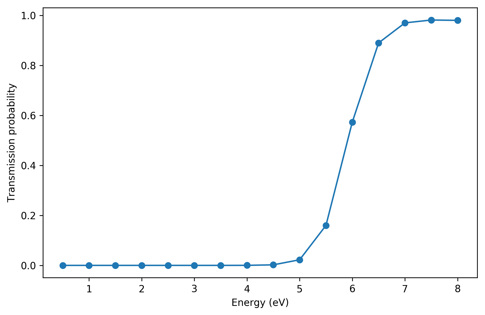
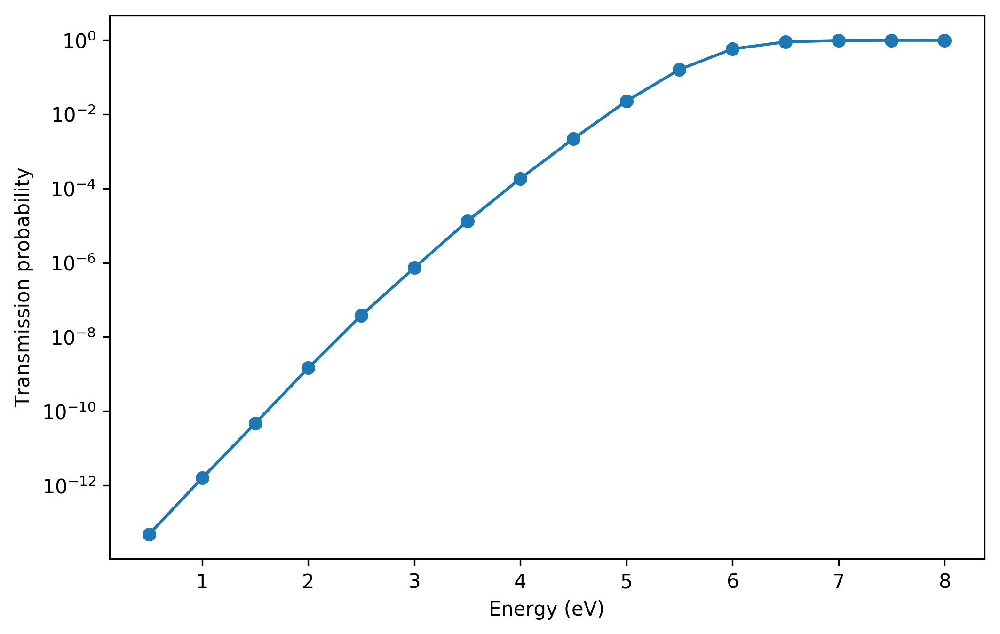

## Overview

The main script `transmission_script.py` calculates electron tunneling probablities of electrons incident on am arbitrary 3d potential barrier.
Free electron model is assumed for the incident, transmitted and reflected waves but the calculation uses a high-density tight-binding lattice to discretize the continuous Hamiltonian.
In transverse directions, periodic boundary conditions are applied.
The quantum transport python library Kwant (https://kwant-project.org/) is used, tested with version 1.3.2.

The script `transmission_script.py` expects a `.npz` file containing data about the potential barrier.
The Jupyter notebook `prepare_vasp_barrier.ipynb` illustrates how this file could be prepared.

## Example with Cu adatom

An example calculation is included for an adatom on a copper (111) surface under 4.0 V/nm electric field.
The potential landscape was calculated with VASP.
The potential barrier is prepared by `prepare_vasp_barrier.ipynb` and is shown in the following figures:

 

The right figure shows the downsampled barrier used for the tight-binding transport calculation.
The resulting transmission dependence on electron energy is shown in the following figures (only difference is the logarithmic scale):

 
